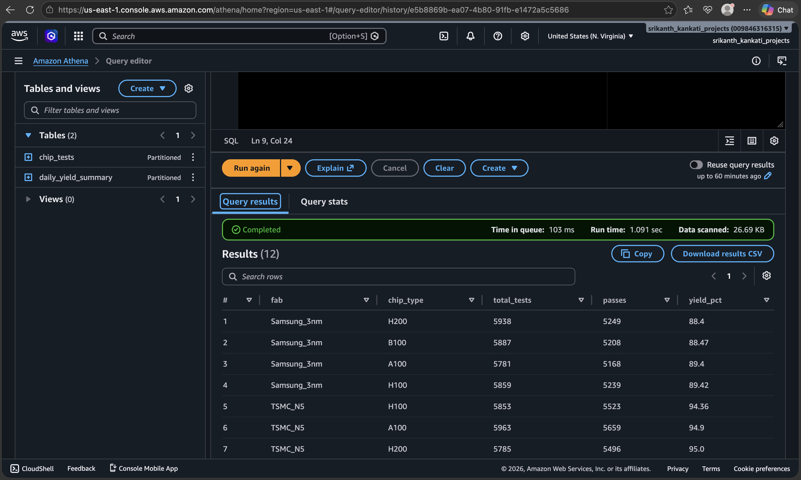
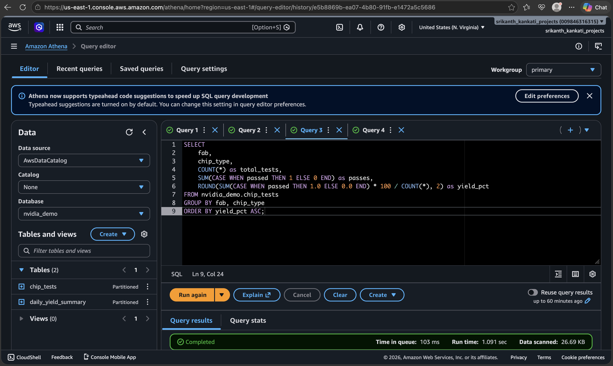
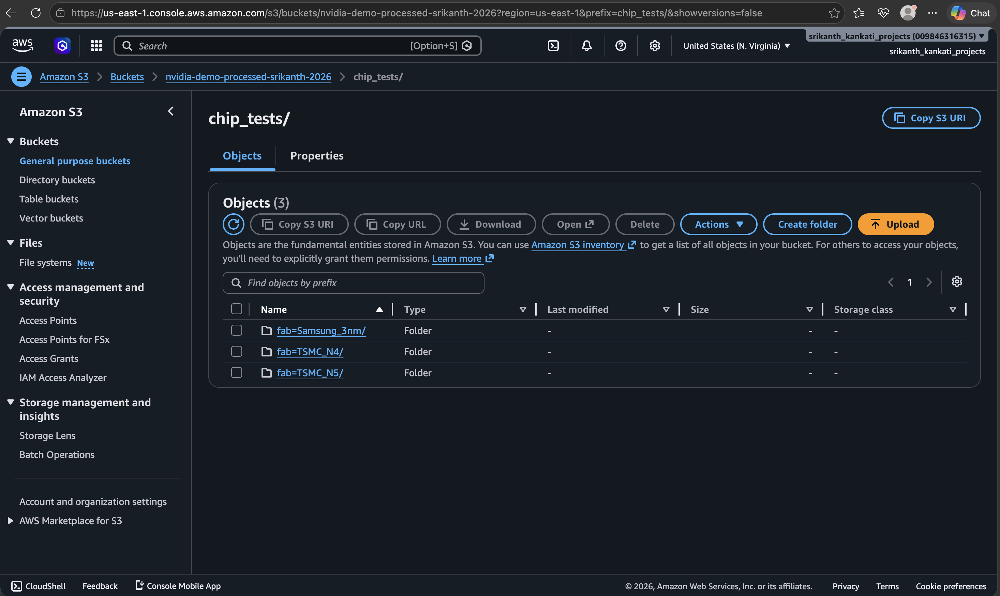
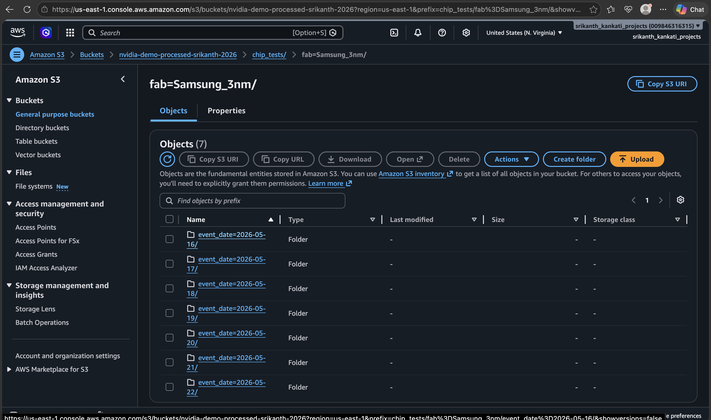
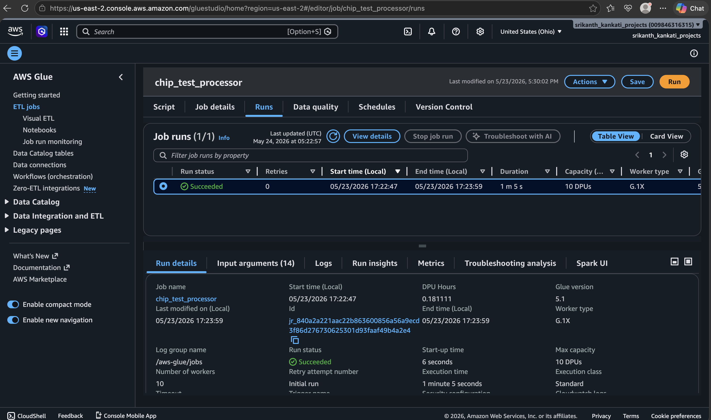
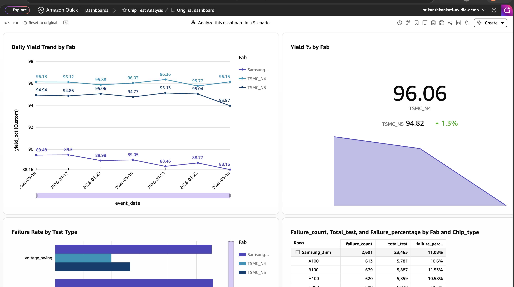
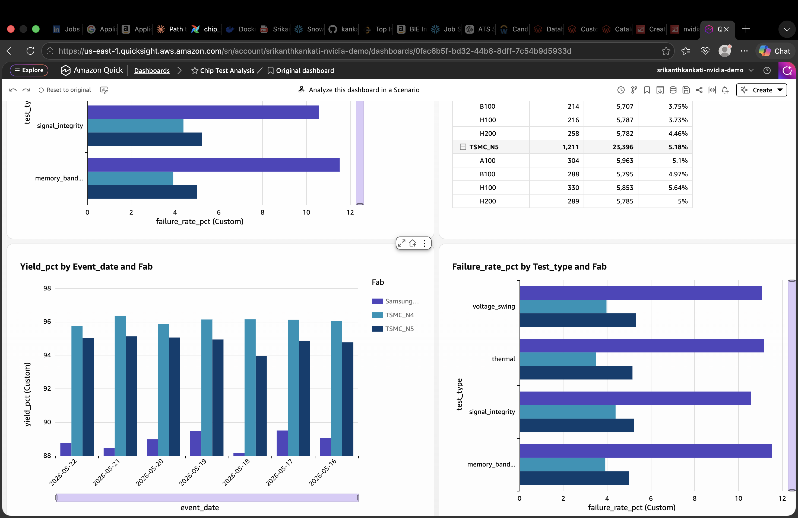
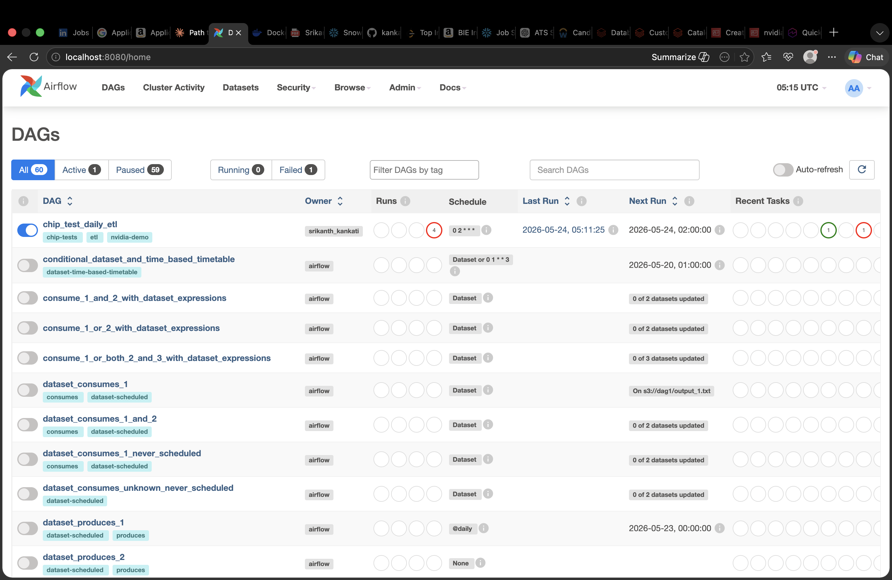
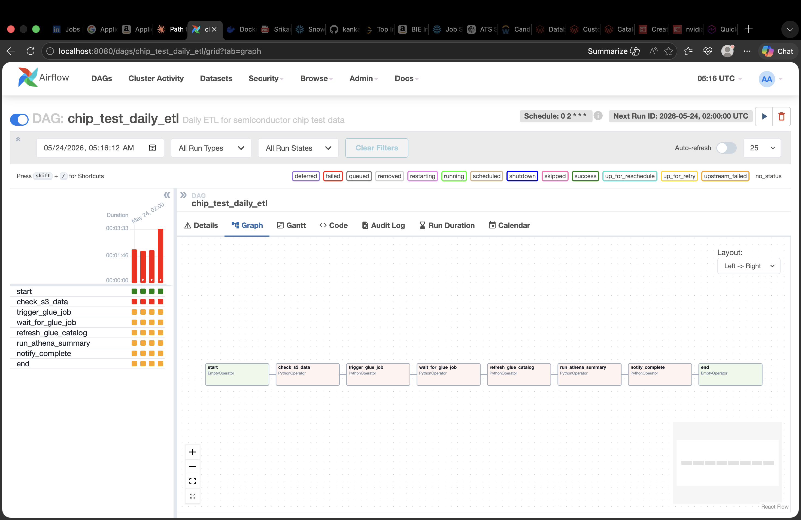
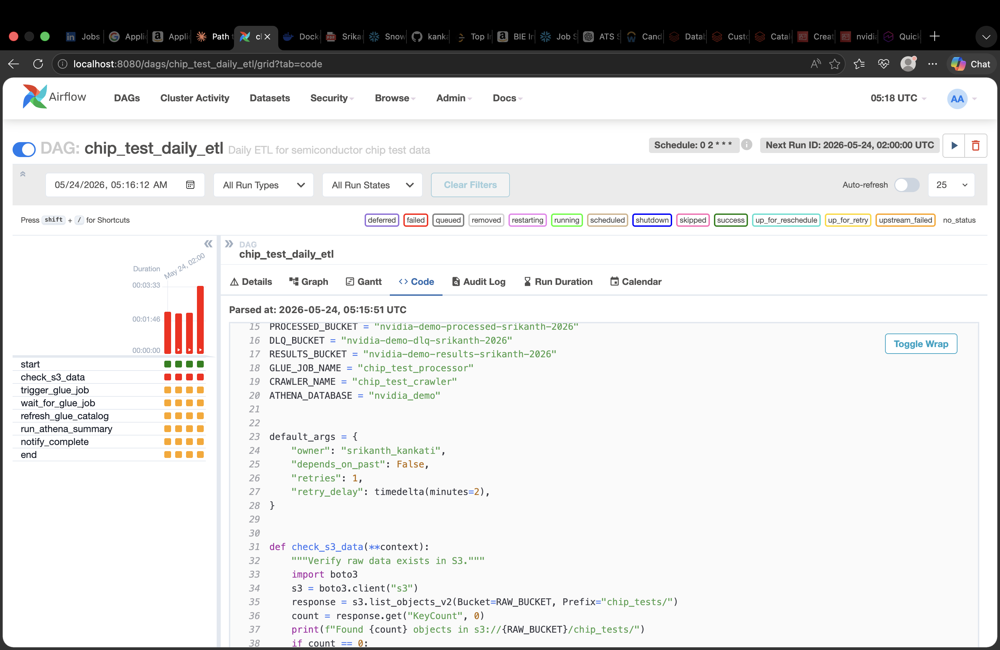

# Semiconductor Chip Test Data Pipeline on AWS

End-to-end data engineering project simulating the pipeline NVIDIA Operations uses to process semiconductor chip test data at scale. Built to demonstrate hands-on proficiency with the architectural patterns described in NVIDIA's **System Data Software Engineer** role.

---

## 🎯 The Insight This Pipeline Surfaced

After processing 70,000 chip test events across 3 fabs and 4 chip types, the pipeline revealed a consistent ~7 percentage point yield gap at Samsung's 3nm fab vs TSMC fabs across all product lines. Exactly the kind of actionable finding that drives a manufacturing investigation.

| fab | chip_type | total_tests | yield_pct |
|---|---|---|---|
| Samsung_3nm | H200 | 5,938 | 88.40 |
| Samsung_3nm | B100 | 5,887 | 88.47 |
| Samsung_3nm | A100 | 5,781 | 89.40 |
| Samsung_3nm | H100 | 5,859 | 89.42 |
| TSMC_N5 | H100 | 5,853 | 94.36 |
| TSMC_N4 | A100 | 5,863 | 96.18 |
| TSMC_N4 | B100 | 5,707 | 96.25 |
| TSMC_N4 | H100 | 5,787 | 96.27 |




---

## 🏗️ Architecture



---

## 🛠️ Stack

| Layer | Technology |
|---|---|
| Language | Python 3.11, PySpark, SQL |
| Storage | Amazon S3 with Hive-style partitioning |
| Format | Parquet with Snappy compression |
| Compute | AWS Glue (serverless Spark) |
| Metadata | AWS Glue Data Catalog |
| Query | Amazon Athena (Presto-based) |
| Orchestration | Apache Airflow 2.9 (Docker Compose) |
| Visualization | Amazon QuickSight with SPICE |

---

## 🔑 Key Engineering Decisions

### Partitioning Strategy
Data partitioned by `fab` and `event_date` — the most common filter dimensions for hardware test queries. Athena uses partition pruning to scan only relevant files, reducing scan cost by 95%+.

### Dead-Letter Queue Pattern
Invalid records routed to a separate S3 path instead of being silently dropped. Critical for semiconductor data quality where a silent drop could hide an upstream sensor calibration issue.

### Broadcast Join for Enrichment
Chip family lookup (4 rows) is broadcast to all Spark executors, eliminating the shuffle stage that a normal join would cause.

### CTAS for Gold Layer
Daily aggregations built as `CREATE TABLE AS SELECT` queries producing optimized partitioned Parquet ready for dashboards.

### Local Airflow via Docker
Running Airflow via `docker compose` avoids the ~$350/month minimum for AWS MWAA while providing the full feature set for development.

---

## 🔍 The PySpark Validation Pattern

```python
# Validate against business rules, route bad rows to DLQ
validated = raw_df.filter(
    F.col("event_id").isNotNull() &
    F.col("chip_id").rlike("^[A-Z][0-9]+-[0-9]+$") &
    F.col("measurement").isNotNull() &
    (F.col("measurement") >= 0) &
    F.col("fab").isin(["TSMC_N4", "TSMC_N5", "Samsung_3nm"])
)

bad_rows = raw_df.subtract(validated)
if bad_rows.count() > 0:
    bad_rows.write.mode("append").json(DLQ_PATH)

# Broadcast join — no shuffle for small reference tables
enriched = validated.join(F.broadcast(chip_family), "chip_type", "left")

# Partitioned Parquet — optimized for Athena partition pruning
enriched.write \
    .mode("overwrite") \
    .partitionBy("fab", "event_date") \
    .option("compression", "snappy") \
    .parquet(PROCESSED_PATH)
```



---

## 📊 QuickSight Dashboard

Interactive dashboard surfacing yield insights with SPICE in-memory caching for sub-second load times:




---

## 🌬️ Airflow DAG Orchestration

The full pipeline is orchestrated via Airflow running locally in Docker Compose:
Each task includes retry logic, polling for long-running Glue jobs, and proper dependency management.





---

## 📁 Repo Files

| File | Purpose |
|---|---|
| `generate_chip_data.py` | Realistic chip test event generator |
| `glue_chip_processing.py` | PySpark validation + enrichment |
| `athena_queries.sql` | Analytical queries + CTAS for gold layer |
| `chip_test_etl.py` | Full pipeline Airflow DAG |

---

## 📈 Results

| Metric | Value |
|---|---|
| Events processed | 70,000 across 7 days |
| Output compression | ~10x smaller after Parquet |
| Insight surfaced | Samsung_3nm yield 7pp lower than TSMC |
| Glue job runtime | ~3 minutes on 2 G.1X workers |
| Athena query cost | < $0.01 per query (partition pruning) |

---

## 🚀 How to Reproduce

```bash
# 1. Generate data
python3 generate_chip_data.py

# 2. Upload to S3
aws s3 sync chip_tests/ s3://YOUR-BUCKET/chip_tests/

# 3. Create AWS Glue job pointing to glue_chip_processing.py
# 4. Run Glue Crawler against processed bucket
# 5. Query in Athena using athena_queries.sql
# 6. Orchestrate via Airflow:
cd airflow && docker compose up -d
# Open http://localhost:8080
```

---

## 👤 About

Built by **Srikanth Kankati** to demonstrate the data engineering patterns relevant to NVIDIA's System Data Software Engineer role.

- **Current role:** BI Developer at Friendly Group, sole owner of an enterprise data platform on AWS, Snowflake and Databricks
- **Experience:** 4+ years in data engineering
- **Certifications:** AWS Certified Solutions Architect, SnowPro Core Certified, Tableau Desktop Certified
- **Education:** MS in Business Analytics, University of Texas at Dallas
- **Contact:** srikanth.kankati27@gmail.com | [LinkedIn](https://linkedin.com/in/srikanth-kankati)
